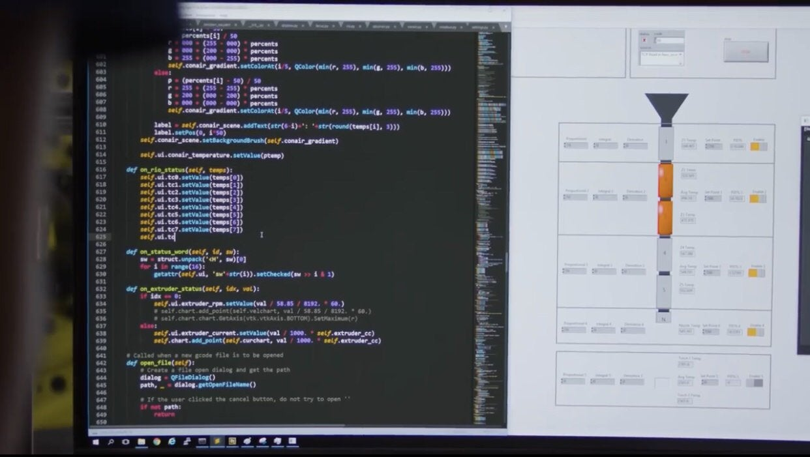

### Python for everyone
#### Что такое Python?
**Python** - это язык высокого уровня, предназначенный для того, чтобы люди могли читать и писать, а компьютеры - читать и обрабатывать. Синтаксис ядра Python минималистичен. В то же время стандартная библиотека включает большой объём полезных функций.

Другие языки высокого уровня: _Java_, _C++_, _PHP_, _Ruby_, _Basic_, _Perl_, _JavaScript_ и многие другие. Центральный процессор (ЦП) не понимает ни один из этих языков высокого уровня.

Процессор понимает язык, который мы называем машинным языком. Машинный язык очень прост и откровенно очень утомителен для написания, потому что он представлен в нулях и единицах:

	10001000100010101101010010101000100100010010010101010101
	10101010101001010100100010000001010101010100101010010101
		
[Машинный язык](https://ru.wikipedia.org/wiki/%D0%9C%D0%B0%D1%88%D0%B8%D0%BD%D0%BD%D1%8B%D0%B9_%D0%BA%D0%BE%D0%B4) на первый взгляд кажется довольно простым, учитывая то, что есть только нули и единицы, но его синтаксис гораздо сложнее, чем Python. Поэтому очень немногие программисты не пишут на машинном языке. Вместо этого мы создаем различные переводчики, чтобы позволить программистам писать на языках высокого уровня, таких как Python или JavaScript, и эти переводчики преобразовывают программы в машинный язык для фактического выполнения процессором.

Так выглядела бы программа "Hello, world", если бы мы её писали на машинном коде:
		```
		01001000 01100101 01101100 01101100 01101111 00101100 
		00100000 01110111 01101111 01110010 01101100 01100100
		```
Поскольку машинный язык привязан к аппаратному обеспечению компьютера, он не переносится на разные типы аппаратного обеспечения. Программы, написанные на языках высокого уровня, можно перемещать между разными компьютерами, используя другой интерпретатор на новом компьютере или перекомпилируя код для создания версии программы на новом языке для машинного языка.

"Переводчики" языков программирования делятся на две основные категории: интерпретаторы и компиляторы.

 - ### Python - интерпретируемый язык


Интерпретатор читает исходный код программы, написанный программистом, анализирует его и интерпретирует инструкции на лету. Когда мы запускаем Python в интерактивном режиме, мы можем набрать строку Python-программы, и Python немедленно ее обрабатывает и готов для ввода другой строки Python.

**Что пишут на Python?**
-   Системные утилиты.
    
-   Web-сайты (Django, Flask, Pyramid, Tornado, TurboGears).
    
-   Приложения для научных расчетов (NumPy, SciPy).
    
-   Прототипы.
    
-   Приложения для Desktop (tkinter, PyQt, wxPython).
    
-   Игры (Pygame).
    
-   Мобильные приложения (kivy).

**Где используется Python?**

-   Компания Google использует Python в своей поисковой системе.
    
-   Такие компании, как Intel, Cisco, Hewlett-Packard, Seagate, Qualcomm и IBM, используют Python для тестирования аппаратного обеспечения.
    
-   Служба коллективного использования видеоматериалов YouTube в значительной степени реализована на Python.
    
-   NSA использует Python для шифрования и анализа разведданных.
    
-   Компании JPMorgan Chase, UBS, Getco и Citadel применяют Python для прогнозирования финансового рынка.
    
-   Популярная программа BitTorrent для обмена файлами в пиринговых сетях написана на языке Python.
    
-   Популярный веб-фреймворк App Engine от компании Google использует Python в качестве прикладного языка программирования.
    
-   NASA, Los Alamos, JPL и Fermilab используют Python для научных вычислений.





