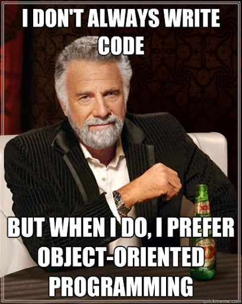
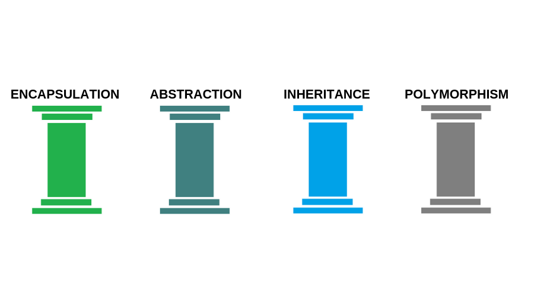
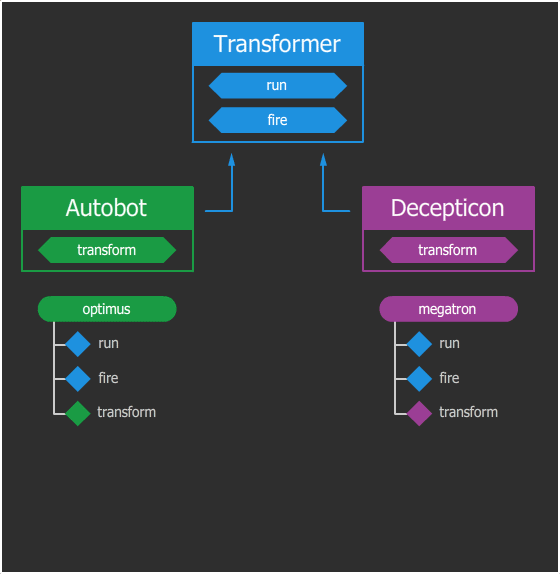

> Объектно-ориентированное программирование — чрезвычайно плохая идея, которая могла возникнуть только в Калифорнии
>> Эдсгер Вибе Дейкстра

ООП (_Объектно-Ориентированное Программирование_) стало неотъемлемой частью разработки многих современных проектов, но, не смотря на популярность, эта парадигма является далеко не единственной. Если вы уже умеете работать с другими парадигмами и хотели бы ознакомиться с оккультизмом ООП, то впереди вас ждет немного лонгрид и два мегабайта картинок и анимаций. В качестве примеров будут выступать трансформеры.

### А зачем мне этот ваш ООП?
- Объектно-ориентированная идеология разрабатывалась как попытка связать поведение сущности с её данными и спроецировать объекты реального мира и бизнес-процессов в программный код. 
- Задумывалось, что такой код проще читать и понимать человеком, т. к. людям свойственно воспринимать окружающий мир как множество взаимодействующих между собой объектов, поддающихся определенной классификации. 

Удалось ли идеологам достичь цели, однозначно ответить сложно, но де-факто мы имеем массу проектов, в которых с программиста будут требовать ООП.

#### Плюсы ООП подхода:
- Экономит время при расширении и модификации
_ Код распределен и часто прост в отладке и тестировании
_ Увеличивается показатель повторного использования кода.
_ «Более естественная» декомпозиция программного обеспечения, которая существенно облегчает его разработку.

#### Минусы ООП подхода:
- Скорость разработки уменьшается
- Увеличение времени выполнения
- Размер кода увеличивается
- Сложность распределения работ на начальном этапе

:::tip

Объектно-ориентированный подход возможен и без классов.

:::

Начнем с самого простого объяснения:

:::tip

`Класс` — это чертеж трансформера.

:::

:::tip

`Экземпляры` этого класса — конкретные трансформеры, например, Оптимус Прайм.

:::

:::tip

`Состояние` — это ряд меняющихся свойств.

:::

И хотя они и собраны по одному чертежу, умеют одинаково ходить, трансформироваться и стрелять, они оба обладают собственным уникальным состоянием. Поэтому у двух разных объектов одного класса мы можем наблюдать разное имя, возраст, местоположение, уровень заряда, количество боеприпасов и т. д. Само наличие этих свойств и их типы описываются в классе.

Таким образом, **класс** — это описание того, какими свойствами и поведением будет обладать объект. А **объект** — это экземпляр с собственным состоянием этих свойств.

Мы говорим «**свойства и поведение**», но звучит это как-то абстрактно и непонятно. Привычнее для программиста будет звучать так: «**переменные и функции**». На самом деле «**свойства**» — это такие же обычные переменные, просто они являются атрибутами какого-то объекта (их называют полями объекта). Аналогично «**поведение**» — это функции объекта (их называют методами), которые тоже являются атрибутами объекта. Разница между методом объекта и обычной функцией лишь в том, что метод имеет доступ к собственному состоянию через поля.
```python
# объявление класса с помощью ключевого слова class
class Transformer:

    # объявление метода конструктора (сюда нам чуть ниже передадут 0)
    def __init__(self, x):
        # инициализация поля x 
        # (переданный конструктору 0 превращается в свойство объекта)
        self.x = x
    # объявление метода run        
    def run(self):
        self.x += 1
        
# а теперь клиентский код:

# создаем новый экземпляр трансформера с начальной позицией 0
optimus = Transformer(0)

optimus.run() # приказываем Оптимусу бежать
print(optimus.x) # выведет 1
optimus.run() # приказывает Оптимусу еще раз бежать
print(optimus.x) # выведет 2
```

** Что мы видим из кода? **

1. self — это специальная локальная переменная (внутри методов), которая позволяет объекту обращаться из своих методов к собственным атрибутам. Обращаю внимание, что только к собственным, то бишь, когда трансформер вызывает свой метод, либо меняет собственное состояние. Если снаружи обращение будет выглядеть так: optimus.x, то изнутри, если Оптимус захочет сам обратиться к своему полю x, в его методе обращение будет звучать так: self.x, то есть "я (Оптимус) обращаюсь к своему атрибуту x". В большинстве языков эта переменная называется this.
self – общепринятое имя для ссылки на объект, в контексте которого вызывается метод. Этот параметр обязателен и отличает метод класса от обычной функции.

2. **\_\_init\_\_** — это специальный (магический) метод, который автоматически вызывается при создании объекта. Конструктор может принимать любые аргументы, как и любой другой метод. В каждом языке конструктор обозначается своим именем. Где-то это специально зарезервированные имена типа __construct, а где-то имя конструктора должно совпадать с именем класса. Назначение конструкторов — произвести первоначальную инициализацию объекта, заполнить нужные поля.

3. **Transformer()** - которое необходимо использовать для создания нового экземпляра какого-либо класса. В этот момент создается объект и вызывается конструктор. В нашем примере, конструктору передается 0 в качестве стартовой позиции трансформера (это и есть вышеупомянутая инициализация).

4. **Методы \_\_init\_\_ и run работают с внутренним состоянием, а во всем остальном не отличаются от обычных функций.**

5. Классы могут обладать методами, которым не нужно состояние и, как следствие, создание объекта. В этом случае метод делают **статическим**.



### Четыре постулата ООП

#### Наследование
**Наследование** — это механизм системы, который позволяет, как бы парадоксально это не звучало, наследовать одними классами свойства и поведение других классов для дальнейшего расширения или модификации.
Что если, мы не хотим штамповать одинаковых трансформеров, а хотим сделать общий каркас, но с разным обвесом? ООП позволяет нам такую шалость путем разделения логики на сходства и различия с последующим выносом сходств в родительский класс, а различий в классы-потомки. Как это выглядит?
Оптимус Прайм и Мегатрон — оба трансформеры, но один является автоботом, а второй десептиконом. Допустим, что различия между автоботами и десептиконами будут заключаться только в том, что автоботы трансформируются в автомобили, а десептиконы — в авиацию. Все остальные свойства и поведение не будут иметь никакой разницы. В таком случае можно спроектировать систему наследования так: общие черты (бег, стрельба) будут описаны в базовом классе «Трансформер», а различия (трансформация) в двух дочерних классах «Автобот» и «Десептикон».

```python
class Transformer:
    def run(self):
        # код, отвечающий за бег
        pass
    
    def fire(self):
        # код, отвечающий за стрельбу
        pass

class Autobot(Transformer): # дочерний класс, наследование от Transformer
    def transform(self):
        # код, отвечающий за трансформацию в автомобиль
        pass

class Decepticon(Transformer): # дочерний класс, наследование от Transformer
    def transform(self):
        # код, отвечающий за трансформацию в самолет
        pass
        
optimus = Autobot()
megatron = Decepticon()
```



Сей пример наглядно иллюстрирует, как наследование становится одним из способов дедуплицировать код [(DRY-принцип)](https://ru.wikipedia.org/wiki/Don’t_repeat_yourself) с помощью родительского класса, и одновременно предоставляет возможности для мутации в классах-потомках.

#### Перегрузка
Если же в классе-потомке переопределить уже существующий метод в классе-родителе, то сработает перегрузка. Это позволяет не дополнять поведение родительского класса, а модифицировать. В момент вызова метода или обращения к полю объекта, поиск атрибута происходит от потомка к самому корню — родителю. То есть, если у автобота вызвать метод `fire()`, сначала поиск метода производится в классе-потомке — `Autobot`, а поскольку его там нет, поиск поднимается на ступень выше — в класс `Transformer`, где и будет обнаружен и вызван. Следует отметить, что модификация нарушает [LSP](https://ru.wikipedia.org/wiki/Принцип_подстановки_Барбары_Лисков) из набора принципов [SOLID](https://ru.wikipedia.org/wiki/SOLID_(объектно-ориентированное_программирование)), но мы рассматриваем только техническую возможность.
Как при описании отношений двух сущностей определить, когда уместно наследование, а когда — композиция? Можно воспользоваться популярной шпаргалкой: спросите себя, сущность А является сущностью Б? Если да, то скорее всего, тут подойдет наследование. Если же сущность А является частью сущности Б, то наш выбор — композиция.

Применительно к нашей ситуации это будет звучать так:
- Автобот является Трансформером? Да, значит выбираем **наследование**.
- Пушка является частью Трансформера? Да, значит — **композиция**.

Для самопроверки попробуйте обратную комбинацию, получится фигня. Эта шпаргалка помогает в большинстве случаев, но бывают и другие факторы, на которые стоит опираться при выборе между композицией и наследованием. Кроме того, эти методы можно комбинировать для решения разного типа задач.

### Ассоциация

Кроме наследования, существует и другой [способ организации межклассового взаимодействия](https://metanit.com/sharp/patterns/1.2.php) – **ассоциация** (агрегация или композиция), при которой один класс является полем другого.

Пример **композиции**:

```python
class Salary:
    def __init__(self,pay):
        self.pay = pay

    def getTotal(self):
        return self.pay * 12

class Employee:
    def __init__(self,pay,bonus):
        self.pay = pay
        self.bonus = bonus
        self.salary = Salary(self.pay)
        
    def annualSalary(self):
        return "Total: " + self.salary.getTotal() + self.bonus

employee = Employee(100,10)
print(employee.annualSalary())
```

Пример **агрегации**:

```python
class Salary(object):
    def __init__(self, pay):
        self.pay = pay

    def getTotal(self):
        return self.pay * 12

class Employee(object):
    def __init__(self, pay, bonus):
        self.pay = pay
        self.bonus = bonus

    def annualSalary(self):
        return "Total: " + self.pay.getTotal() + self.bonus

salary = Salary(100)
employee = Employee(salary, 10)
print(employee.annualSalary())
```

Ассоциированные объекты могут [циклически ссылаться](https://ru.wikipedia.org/w/index.php?title=Циклическая_ссылка&action=edit&redlink=1) друг на друга, что ломает стандартный механизм сборки мусора.

#### Множественное наследование
Мы рассмотрели ситуацию, когда два класса унаследованы от общего потомка. Но в некоторых языках можно сделать и наоборот — унаследовать один класс от двух и более родителей, объединив их свойства и поведение. Возможность наследоваться от нескольких классов вместо одного — это множественное наследование.


### Полиморфизм 