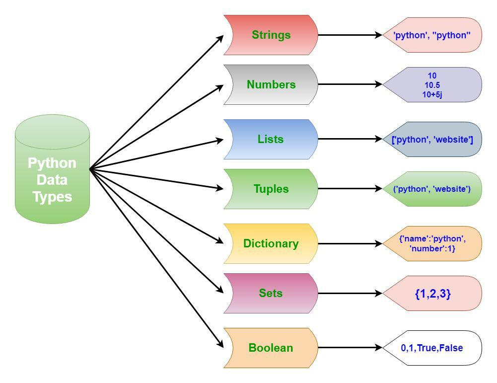

Каждое значение в Python имеет тип. Поскольку всё в Python — объекты, типы являются классами, а значения — экземплярами (объектами) этих классов.

В Python есть разные типы, давайте рассмотрим самые основные.

## Числа

Целые числа, числа с плавающей запятой и комплексные числа относятся к группе чисел. В Python они представлены классами int, float и complex.

Мы можем использовать функцию type(), чтобы узнать класс переменной или значения, и функцию isinstance() для проверки принадлежности объекта определённому классу:
```python
a = 5
print(a, "is of type", type(a))
# 5 is of type <class 'int'>

a = 2.0
print(a, "is of type", type(a))
# 2.0 is of type <class 'float'>
```

Целые числа могут быть любой длины, они ограничиваются лишь доступной памятью.

Числа с плавающей запятой имеют ограниченную точность. Визуально разницу между целым числом и числом с плавающей запятой можно заметить в консоли по наличию точки: 1 — целое число, 1.0 — с плавающей запятой.

## Списки
Список представляет собой упорядоченную последовательность элементов. Он очень гибкий и является одним из самых используемых типов в Python. Элементы списка не обязательно должны быть одного типа.

Объявить список довольно просто. Внутрь квадратных скобок помещаются элементы списка, разделённые запятой:
```python
a = [1, 2.2, 'python']
```
Мы можем использовать оператор [] для извлечения элемента (такая операция называется «доступ по индексу») или диапазона элементов (такая операция назвается «извлечение среза») из списка. В Python индексация начинается с нуля:
```python
a = [5, 10, 15, 20, 25, 30, 35, 40]
print("a[2] =", a[2])
print("a[0:3] =", a[0:3])
print("a[5:] =", a[5:])
```
Списки являются изменяемым типом, т.е. значения его элементов можно изменить:
```python
a = [1, 2, 3]
a[2] = 4

# [1, 2, 4]
```
### Операции со спискам
Со списками можно легко делать много разных операций.

| x in A | Проверить, содержится ли элемент в списке. Возвращает True или False |
| ----   | ---- |
| x not in A | То же самое, что not(x in A) |
| min(A) | Наименьший элемент списка |
| max(A) | Наибольший элемент списка |
| A.index(x) | Индекс первого вхождения элемента x в список, при его отсутствии генерирует исключение ValueError |
| A.count(x) | Количество вхождений элемента x в список |

## Срезы
Со списками, так же как и со строками, можно делать срезы. А именно:

`A[i:j]`  срез из j-i элементов `A[i]`, `A[i+1], ..., A[j-1]`.
`A[i:j:-1]`  срез из i-j элементов `A[i]`, `A[i-1], ..., A[j+1]` (то есть меняется порядок элементов).
`A[i:j:k]`  срез с шагом k: `A[i]`, `A[i+k]`, `A[i+2*k],...` . Если значение k<0, то элементы идут в противоположном порядке.

Каждое из чисел i или j может отсутствовать, что означает “начало строки” или “конец строки”

Списки, в отличии от строк, являются изменяемыми объектами: можно отдельному элементу списка присвоить новое значение. Но можно менять и целиком срезы. Например:
```python
A = [1, 2, 3, 4, 5]
A[2:4] = [7, 8, 9]
```
Получится список, у которого вместо двух элементов среза A[2:4] вставлен новый список уже из трех элементов. Теперь список стал равен [1, 2, 7, 8, 9, 5].
```python
A = [1, 2, 3, 4, 5, 6,  7]
A[::-2] = [10, 20, 30, 40]
```
Получится список `[40, 2, 30, 4, 20, 6, 10]`. Здесь `A[::-2]` — это список из элементов `A[-1], A[-3], A[-5], A[-7]`, которым присваиваются значения `10, 20, 30, 40` соответственно.
Если не непрерывному срезу (то есть срезу с шагом k, отличному от 1), присвоить новое значение, то количество элементов в старом и новом срезе обязательно должно совпадать, в противном случае произойдет ошибка ValueError.

:::tip
Обратите внимание, `A[i]` — это элемент списка, а не срез!
:::

## Кортежи
Так же как и список, кортеж (tuple) является упорядоченной последовательностью элементов. Вся разница заключается в том, что кортежи неизменяемы.

Кортежи используются для защиты данных от перезаписи и обычно работают быстрее, чем списки, т.к. их нельзя изменять.

Для создания кортежа нужно поместить внутрь круглых скобок элементы, разделённые запятой:
```python
t = (5,'program', 1+3j)
```
Мы можем использовать оператор извлечения среза [] для извлечения элементов, но мы не можем менять их значения:
```python
t = (5,'program')
print("t[1] =", t[1])
```

## Строки
Строка представляет собой последовательность символов. Мы можем использовать одинарные или двойные кавычки для создания строки.  Многострочные строки можно обозначить тройными кавычками, ''' или """:
```python
s = "Простая строка"
s = '''многострочная
строка'''
s = """многострочная
строка"""
```

Как и в случае со списками и кортежами, мы можем использовать оператор [] и со строками. Стоит отметить, что строки в Python относятся к категории неизменяемых последовательностей, то есть все функции и методы могут лишь создавать новую строку.

## Множества
Множество является неупорядоченной уникализированной последовательностью. Объявляется множество с помощью элементов, разделённых запятой, внутри фигурных скобок:
```python
a = {5, 2, 3, 1, 4}
print("a =", a)

a = {1, 2, 3, 4, 5}
print(type(a))
# <class 'set'>
```
Над множествами можно выполнять такие операции, как объединение и пересечение. Т.к. элементы в множестве должны быть уникальны, они автоматически удаляют дубликаты:
```python
a = {1,2,2,3,3,3}
print(a) # {1, 2, 3}
```
Поскольку множество является неупорядоченной последовательностью, оператор извлечения среза здесь не работает:
```python
a = {1,2,3}
print(a[1]) # Error
```
```notebook
Traceback (most recent call last):
  File "<stdin>", line 1, in <module> 
TypeError: 'set' object does not support indexing
```
### Использование операций над множествами
Допустим у нас есть два множества:
```python
a = {1, 2, 3}
b = {3, 4, 5}
```
| Операция | Запись | Результат |
| -----    | ----   | ---       |
| Пересечение | a & b | {3} |
| Объединение | a \| b   | {1, 2, 3, 4, 5} |
| Разность | a - b    | {1, 2} |
| Исключающее ИЛИ | a ^ b | {1, 2, 4, 5} |

## Словари
Словари — неупорядоченные наборы пар ключ-значение.

Они используются, когда нужно сопоставить каждому из ключей значение и иметь возможность быстро получать доступ к значению, зная ключ. В других языках словари обычно называются map, hash или object. Словари оптимизированы для извлечения данных. Чтобы извлечь значение, нужно знать ключ.

ловарь объявляется парами элементов в форме {ключ : значение}, заключенными в фигурные скобки:

```python
d = {1:'value', 'key':2}

print(type(d)) # <class 'dict'>
```
Значение может быть любого типа, а вот ключ — только неизменяемого.

Мы используем ключ, чтобы получить соответствующее ему значение. Но не наоборот:

```python
d = {1:'value', 'key':2}
print("d[1] =", d[1])

value = 'value'
d[1] = value
print("d['key'] =", d['key'])
d['key'] = 2

print("d[2] =", d[2]) # Приводит к ошибке
```
## Преобразование типов данных
Мы можем преобразовывать значения из одного типа в другой с помощью таких функций, как int(), float(), str() и т.д.
```python
float(5)
# 5.0
```
При преобразовании числа с плавающей запятой в целое будет утеряна часть после запятой:
```python
int(10.6)
# 10
```

```python
int(-10.6)
# -10
```

Для преобразования из/в строку должны использоваться совместимые значения:
```python
float('2.5')
# 2.5
```
```python
str(25)
# '25'
```

```notebook
>>> int('1p')
Traceback (most recent call last):
  File "<stdin>", line 1, in <module>
ValueError: invalid literal for int() with base 10: '1p'
```

Можно даже преобразовывать одну последовательность в другую:
```python
print(set([1,2,3]))
# {1, 2, 3}

print(tuple({5,6,7}))
# (5, 6, 7)

print(list('hello'))
# ['h', 'e', 'l', 'l', 'o']
```
Для преобразования списка из символов обратно в строку нельзя вызвать str(список), так как в результате мы получим строковое представление списка (наподобие того, что мы видим, когда выводим список на экран). Вместо этого нужно сделать следующее:
```python
''.join(['h', 'e', 'l', 'l', 'o'])
```

Для преобразования в словарь каждый элемент последовательности должен быть парой:
```python
print(dict([[1, 2],[3, 4]]))
# {1: 2, 3: 4}

print(dict([(3,26),(4,44)]))
# {3: 26, 4: 44}
```


## Таблица типов данных

Данный раздел должен быть интересен тем, кто хочет стать Python разработчиком. Знание того, как устроен Python очень важны на практике, чтобы не допускать ошибок. Вы еще услышите фразу "everything in Python is an object". Объекты - это абстракции для данных, и на Python существует удивительное разнообразие структур данных, которые вы можете использовать для представления данных, или комбинировать их для создания собственных пользовательских данных.
Первое фундаментальное различие, которое Python проводит по данным, заключается в том, меняется ли значение объекта. Если значение может измениться, объект называется изменяемым (mutable), а если значение не может измениться, то объект называется неизменяемым (immutable).

| Immutable | Mutable |
| --- | --- |
| bool | list |
| int, float, str | dict |
| tuple | set |

## Задания
### Крутые IT-компании Одессы
Дан список с названиями крутых IT-компаний Одессы. Ваша задача вывести 2, 5, 8 элемент этого списка. 
`location = ['Provectus', 'Norse', 'Ciklum', 
             'Luxoft', 'Beetroot', 'Ubisoft', 'Sigma', 'Snapchat', 'Lohika']`
## Посчитайте, сколько раз символ "o" встречается в строке 
`string = 'Python Software Foundation'`