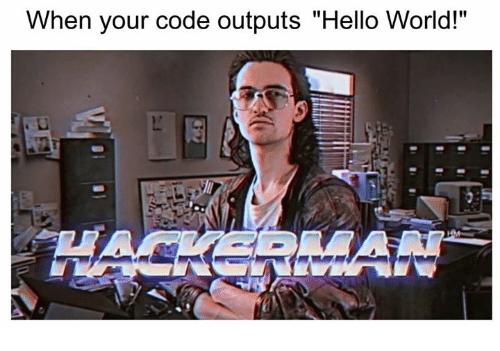
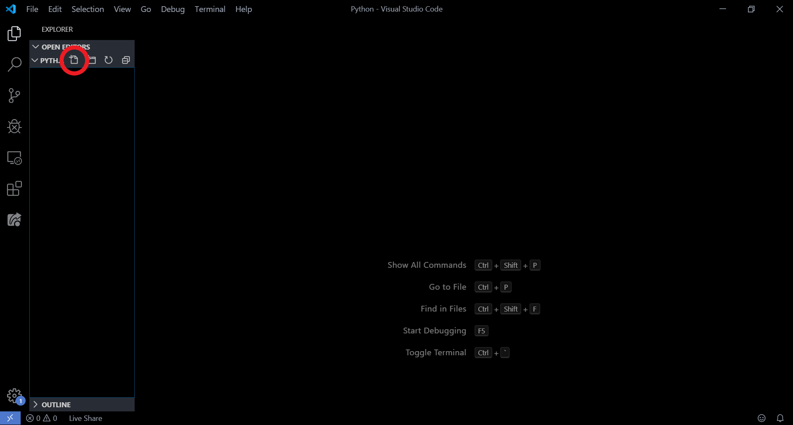

export const Highlight = ({children, color}) => ( <span style={{
      backgroundColor: color,
      borderRadius: '2px',
      color: '#fff',
      padding: '0.2rem',
    }}>{children}</span> );

<Row className="justify-content-md-center">
    <Col xs={12} sm={4} md={4}>
        
    </Col>
</Row>

Первая программ должна быть незабываемой! Хм... А пусть наша программа поздоровается с миром!

Для начала, вам необходимо открыть **Visual Code**. И создать новый файл, который будет называться `helloworld.py` Для этого нам необходимо нажать на иконку создания файла в панеле слева. 

Напишем такой код:
```python
print('Hello, world')
```
Чтобы запустить программу необходимо открыть терминал для это нужно нажать на кнопку "Terminal" в верхнем меню и выбрать "New Terminal".  Также можно вызвать сочетанием клавиш **Crtl + Shift + `**

:::note

<Highlight color="#ff6600">Терминал</Highlight> - это программа, в которую терминал посылает пользовательский ввод. Оболочка генерирует вывод и передает его обратно в терминал для отображения.

:::

В появившемся окне пишем команду запуска нашего файла:
```notebook
python helloworld.py
```
:::note
Вы, наверное, уже заметили, что название python-файла имеет расширение .py - это стандратное расширение Python-файлов. 
:::
**print("some text")** - это стандартная функция **Python**, которая принимает на вход объект - строку (и не только строку), и выводит его на экран.  Что такое функция в программировании, узнаем позже. Пока будем считать, что print() – это такая команда языка Python, которая выводит то, что в ее скобках на экран.
Отлично! Вот мы и написали нашу первую программу, которая выводит всемирно известное "Hello, world".  Go ahead!

## Переменные
Одной из самых мощных функций языка программирования является способность манипулировать переменными. 
:::note
Переменная - это имя, которое ссылается на значение.
:::
**Переменные** позволяют хранить данные под «ярлыками»-именами и через них обращаться к этим данным. Вместо того чтобы давать точную ссылку на адрес, под которым в памяти компьютера хранятся какие-либо сведения, достаточно запро­сить об этих сведениях переменную.

Это все равно что звонить другу по мобильному телефону. С точки зрения звонящего, совершенно неважно, где сейчас нахо­дится адресат звонка. Несколько нажатий клавиши, и вот вы уже беседуете.

Впрочем, прежде, чем пользоваться переменной, ее надо создать, как в следующей строке кода:
```python
name = 'IT2School'
number = 5
```
Это так называемая операция присвоения. В ней создается переменная которой присваивается значение name — ссылка на строку «IT2School». Вообще принято говорить, что переменным присваиваются значения. Но переменным можно присваить не только слова, строки, но и цифры!  В Python нет необходимости указать тип переменной. Например в языке Си необходимо указать int, char, long и так далее. Python сам определит к какому типу относится переменная. Если кавычки, значит строка.

### Правила задания имен переменных

Существует ряд правил, которых следует придерживаться при наименовании переменных.
- Имена переменных **не могут** содержать пробелов (формально, имя переменной состоит из одного слова).
- Имена переменных **могут** состоять только из букв, цифр и нижнего подчёркивания (_).
- Имя переменной **не может** начинаться с цифры.

Для примера рассмотрим правильные и неправильные имена переменных:
#### Таблица корректности переменных
| Правильно | Неправильно |
| ----------|--------|
| my_int | my-int |
| int4 | 4int |
|MY_INT | $MY_INT|
|another_int | another int|

Выбирая имя для переменной, следует также учитывать регистр: my_int, MY_INT, My_Int и mY_iNt – не одна, а четыре разные переменные.

:::tip
Избегайте похожих имён переменных в рамках одной программы.
:::

Кроме того, имя переменной должно отвечать условиям соглашения. При именовании переменной принято начинать имя со строчной буквы и использовать подчеркивание при разделении слов. Переменная, чье имя начинается с большой буквы или написано в верблюжьем регистре, будет считаться недействительным.

Но самое главное правило – это быть последовательным. Если уж вы начали использовать в программе переменные, написанные в верблюжьем стиле, продолжайте следовать этому принципу до конца.
**Читайте также**: [PEP 8](https://www.python.org/dev/peps/pep-0008/) – официальный мануал по кодированию в Python.
| Правильно | Неправильно |
| my_int | myInt | 
| int4 | Int4 |
| my_first_string | myFirstString |
###Переназначение переменной
Значение переменной (что видно из самого понятия) можно изменять.

Возможность переназначения переменной очень важна: это позволяет программе добавлять пользовательские значения в существующие переменные, вернуть переменной прежнее значение и т.п.
Попробуйте задать в переменной x число, а затем переназначить её и задать строку:
```python
x = 76
print(x) # 76

x = "I love Python"
print(x) # I love Python
```
Если бы программа была написана так:
```python
x = 76
x = "I love Python"
print(x)
```
В результате на экране появилось бы только второе присвоенное значение, так как это последнее назначение:
```
I love Python
```

### А как тебя зовут и сколько тебе лет?

#### input - что это такое и с чем его едят?
Мы уже научились выводить, сохранять данные, а теперь научимся принимать информация от пользователя. Для этого в Python есть конструкция `input()`

Когда вызывается эта функция, программа останавливает свое выполнение и ждет, когда пользователь введет текст. После этого, когда он нажмет Enter, функция input() заберет введенный текст и передаст его программе, которая уже будет обрабатывать его согласно своим алгоритмам.
```python
name = input()
age = input()
print(name," ", age)
```
## Задания

#### Программисты-художники
Ваша задача нарисовать елку в консоли используя только инструкцию print(). Примерно такое у вас должно получить в консоли: 
```notebook
        *
       * *
     *******
    *********
   ***********
  *************
 ***************
       * *
       * *
```
#### Данные
Нужно написать программу, которая будет спрашивать данные о пользователе - имя, фамилия и возраст. Ах да, не забудьте их вывести на экран!