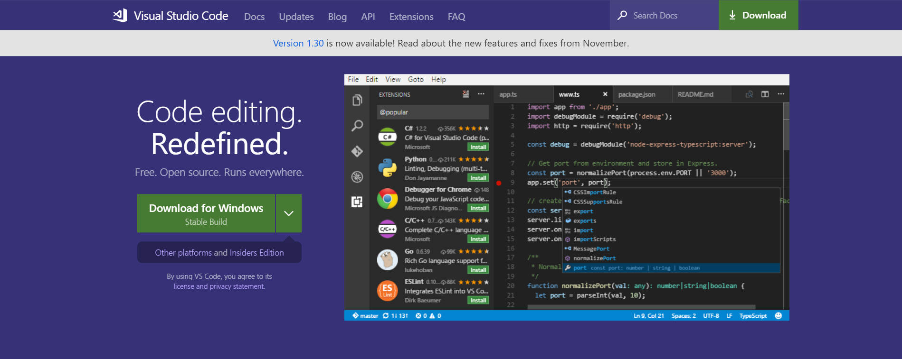

Давайте начнем с установки среды разработки и самого Python.

Существует множество различных способов установки Python. Мы покажем основные и самые ходовые.

### Ухвати Python за хвост

Заходим на официальный сайт [Python](https://www.python.org/)

Переходим во вкладку "**Downloads**" и скачиваем последнюю версию Python ( 3.7.2 - самая свежая на 25.01.2019). Нажимаем "**Download**" и прокручиваем страницу в самый низ.

Выбираем нужный установщик: Если у вас Windows, то _Windows_  _x86-64 executable installer,_
если у вас Mac OS X, то _macOS 64-bit/32-bit installer._

:::tip
### При установке обязательно поставьте галочку "Add Python 3.7.2 to PATH"
:::

Теперь если мы нажмем "Пуск" (Windows) и начнем искать Python, то результат поиска будет такой - IDLE (Python 3.7.2). Давайте запустим и посмотрим, что это такое.

Это стандартный редактор кода Python, который устанавливается вместе с пакетами языка.

### Приручаем Python в Visual Code

Для визуализации нашего кода мы будем использовать редактор Visual Code. Переходим на официальный сайт Visual Code.

Нажимаем кнопку _"Download for Windows"_ (если у вас Linux или macOS, то _"Download for macOS/Linux"_). После этого ждем окончания загрузки файла, а затем устанавливаем его.

Теперь открываем Visual Code и приступаем к настройке среды разработки.
##
### Настройка среды VS Code
В редакторе, с левой стороны расположены функции быстрого доступа. Нам нужно установить Debugger для Python, чтобы комфортно отлаживать код и смотреть на внутренности программы.
Переходим во вкладку **"Extensions"** (пятая сверху) и в поиске пишем "Python". Затем нажимаем на зеленую кнопку "Install".

После того, как мы установили расширение, нужно перезапустить редактор. Для это нужно нажать кнопку "Reload".

:::note

**Замечательно, установка и настройка среды окончена! Теперь приступим к изучению Python!**

:::