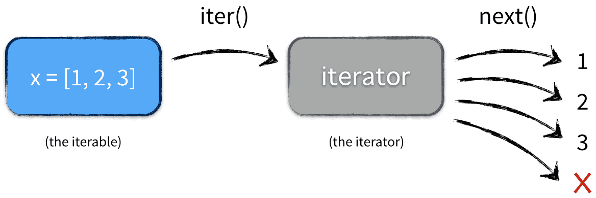
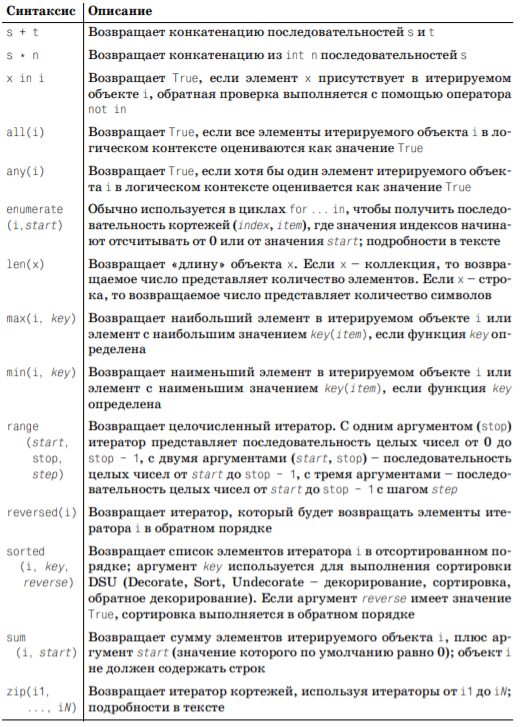

**Итерируемые объекты** (`iterable`) — это любые объекты, предоставляющий возможность поочерёдного прохода по циклу (коллекции). Коллекции не должны обязательно существовать в памяти и быть конечными.

**Итератор** (`iterator`) — это объект, который выполняет фактический проход по элементам.



Давайте уточним определения. Итерируемый — объект, в котором есть метод `__iter__`. В свою очередь, **итератор** — объект, в котором есть два метода: `__iter__` и `__next__`. почти всегда **iterator** возвращает себя из метода `__iter__`, так как они выступают итераторами для самих себя, но есть исключения.
В целом стоит избегать прямого вызова `__iter__` и `__next__`. При использовании for или генераторов списков Python вызывает эти методы сам. Если всё-таки необходимо вызвать методы напрямую, используйте встроенные функции `iter` и next и в параметрах передавайте итератор или контейнер. Например, если c — итерируемый, используйте конструкцию `iter(c)` вместо `c.__iter__()`. Если a — итератор, используйте `next(a)`, а не `a.__next__()`.

Звучит сложно, но давайте рассмотрим живой пример — итерирование списка. Список — итерируемый, поэтому нам подходит. Итак, создадим список и итератор для него:

```python
l = [1, 2, 3, 4, 5]
i = iter(l)
print(i) # <list_iterator object at 0x0383FF70>
```

Общие функции и операторы для работы с итерируемыми объектами:


## Создание собственных итераторов
Если нужно обойти элементы внутри объекта вашего собственного класса, необходимо построить свой итератор. Создадим класс, объект которого будет итератором, выдающим определенное количество единиц, которое пользователь задает при создании объекта. Такой класс будет содержать конструктор, принимающий на вход количество единиц и метод `__next__()`, без него экземпляры данного класса не будут итераторами.

import Tabs from '@theme/Tabs';
import TabItem from '@theme/TabItem';

<Tabs
  defaultValue="first-example"
  values={[
    { label: 'First example', value: 'first-example', },
    { label: 'Second example', value: 'second-example', },
  ]
}>
<TabItem value="first-example">

```py
class SimpleIterator:
    def __init__(self, limit):
        self.limit = limit
        self.counter = 0

    def __next__(self):
        if self.counter < self.limit:
            self.counter += 1
            return 1
        else:
            raise StopIteration

s_iter1 = SimpleIterator(3)
print(next(s_iter1))
print(next(s_iter1))
print(next(s_iter1))
print(next(s_iter1))
```

</TabItem>
<TabItem value="second-example">

```py
class SimpleIterator:
    def __iter__(self):
        return self

    def __init__(self, limit):
        self.limit = limit
        self.counter = 0

    def __next__(self):
        if self.counter < self.limit:
            self.counter += 1
            return 1
        else:
            raise StopIteration

s_iter2 = SimpleIterator(5)
for i in s_iter2:
    print(i)
```

</TabItem>
</Tabs>

 В нашем примере при четвертом вызове функции next() будет выброшено исключение StopIteration. Если мы хотим, чтобы с данным объектом можно было работать в цикле for, то в класс SimpleIterator нужно добавить метод __iter__(), который возвращает итератор, в данном случае этот метод должен возвращать self.
Зачем нужны итераторы?
Итераторы позволяют вам сделать поочередно перебрать элементы, которые будут вычисляется по мере их поступления. Использование итератора вместо списка list, набора set или другой итерируемой структуры данных может иногда позволить нам сэкономить память. 
Например, мы можем использовать itertools.repeat, чтобы создать итерируемый объект с большим количество элементов:
from itertools import repeat
import sys

lots_of_fours = repeat(4, times=100_000_000) # массив на 400 миллионов элементов
sys.getsizeof(lots_of_fours) # На моей машине это занимает 24 байта